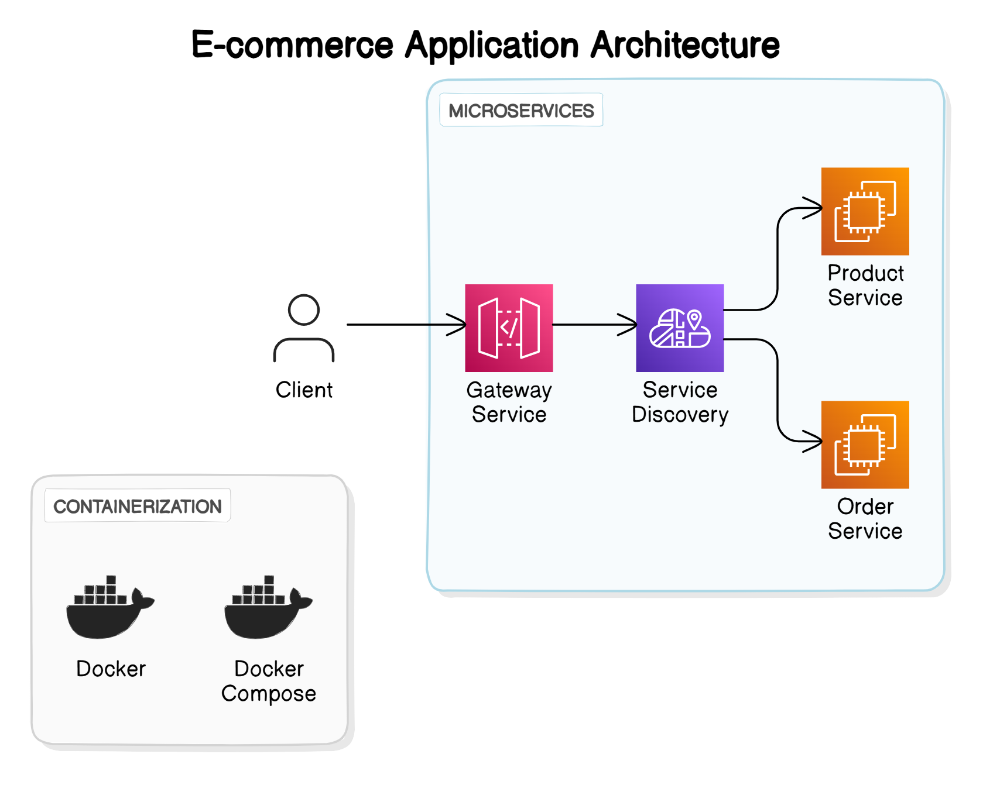

# Java Intermediate Labs – Microservices & Security

This repository contains several labs focused on building and securing Java microservices using Spring Boot, OAuth2, and JWT. Each lab demonstrates a key concept in modern backend development.

---

## Lab 1: Ecommerce Microservice Architecture (`micro-ecommerce`)

### Overview

This lab demonstrates how to build an ecommerce application using a microservices architecture. The system is composed of several independent services, each responsible for a specific domain.



### Components

- **Gateway Service**: Routes client requests to the appropriate microservice. (Port: 8765)
- **Service Discovery (Eureka)**: Handles service registration and discovery, enabling dynamic communication between services. (Port: 8761)
- **Product Service**: Manages product-related operations (listing, details). (Port: 8082, Endpoint: `/api/v1/products`)
- **Order Service**: Handles order-related operations (placing, viewing orders). (Port: 8081, Endpoint: `/api/v1/orders`)

### Technologies Used

- Spring Boot
- Spring Cloud (Eureka)
- Docker & Docker Compose

### Running the Lab

1. **Clone the repository** and navigate to the `micro-ecommerce` directory.
2. **Start all services** using Docker Compose:
   ```bash
   docker compose up --build
   ```
3. **Access the services:**
   - Gateway: [http://localhost:8765](http://localhost:8765)
   - Service Discovery: [http://localhost:8761](http://localhost:8761)
   - Product Service: [http://localhost:8082/api/v1/products](http://localhost:8082/api/v1/products)
   - Order Service: [http://localhost:8081/api/v1/orders](http://localhost:8081/api/v1/orders)

---

## Lab 2: Integrate OAuth2 with a Social Login Provider (`social-auth`)

### Scenario

Enable users to register and log in to your e-commerce application using their existing social media accounts (e.g., Google, Facebook).

### Tasks & Implementation

- **Choose a social login provider** (Google used in this lab).
- **Configure Spring Security** to integrate with the provider's OAuth2 flow.
- **User Flow**: Users log in with their social credentials, granting access to your app.
- **Retrieve user info** (name, email) from the provider after login.

#### Steps

1. **OAuth2 Client Setup**: Use Spring Security's OAuth2 client support to configure Google as the provider.
2. **Credentials**: Add client ID and secret from Google Developers Console to your configuration.
3. **Authentication**: Spring Security handles the OAuth2 flow, including redirects.
4. **User Details**: After login, retrieve user info from the authentication object.

#### Example

- Login page: [http://localhost:8080/login](http://localhost:8080/login)
- 

---

## Lab 3: Secure a REST API with JWT Authentication (`social-jwt`)

### Scenario

Secure a REST API for a social media platform. Users must be authenticated with JWT before accessing protected endpoints.

### Tasks & Implementation

- **JWT Authentication**: Implement JWT-based login in Spring Boot.
- **Login Flow**: Users log in with username/password and receive a JWT token.
- **Securing Endpoints**: Require a valid JWT in the Authorization header for protected endpoints.
- **Token Validation**: Implement logic to validate and decode JWTs in controllers.

#### Example Payload

```json
{
  "email": "roczyno",
  "password": "password"
}
```

#### Example Response

```json
{
  "token": "<JWT_TOKEN>",
  "email": {
    "password": null,
    "username": "roczyno",
    "authorities": [{ "authority": "read" }],
    "accountNonExpired": true,
    "accountNonLocked": true,
    "credentialsNonExpired": true,
    "enabled": true
  }
}
```

---

## Lab 4: Monitor Application Health with Actuator Endpoints (`social-jwt`)

### Scenario

Monitor the health and performance of your Spring Boot application in production.

### Tasks & Implementation

- **Enable Spring Boot Actuator** for health and metrics endpoints.
- **Explore endpoints**: `/health`, `/metrics`, `/env`, etc.
- **Visualize metrics**: Use tools like Grafana or Prometheus.
- **Secure Actuator endpoints** with authentication.

- Example Grafana dashboard config: [`extra/12900_rev3.json`](social-jwt/extra/12900_rev3.json)

---

## How to Use This Repository

- Each lab is self-contained in its own directory.
- Follow the instructions in each section above to run and experiment with the labs.
- All services use standard Spring Boot conventions and can be run with Maven or Docker Compose as described.
